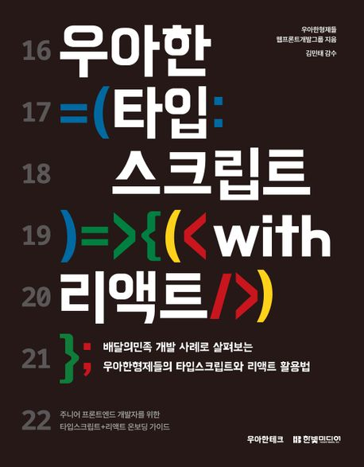
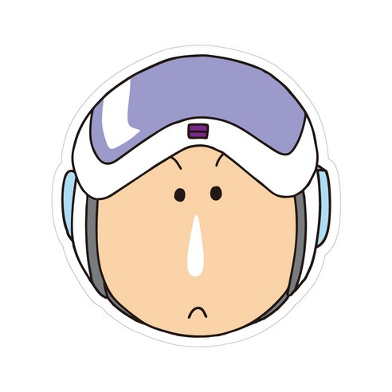

# 📚 [우아한 타입스크립트 with 리액트] 북 스터디 📚

|  |
| ------------------------------------------------------ |

 

## 📣 진행 방식 📣

- 스터디는 주 2회 (월/목 21:00 - 22:00) 진행됩니다.
- 스터디는 책의 챕터를 기준으로 분류됩니다. 스터디원 모두는 해당 챕터 스터디 진행 전까지 내용을 읽어옵니다.
- 챕터의 담당자는 스터디 진행 전까지 내용 정리를 진행합니다.
  - 정리본은 markdown으로 작성하고 제목은 담당자의 이름입니다.
  - 챕터 명으로 만들어진 폴더에 업로드합니다. (ex. [2장] 타입/이성령.md)
  - branch : main
- 챕터의 담당자를 제외한 나머지 스터디원은 문제를 준비합니다.
  - [GitHub issue](https://github.com/Coding-Village-Protector/woowahan-ts/issues)로 해당 챕터의 label을 적용하여 작성합니다. 문제의 양식은 템플릿을 준수합니다.
  - 문제는 스터디 진행 전날부터 진행 직전까지 등록합니다.
  - 문제 출제자를 제외한 나머지 스터디원은 문제에 대한 답안을 미리 작성하여도 무방합니다.
- 스터디를 진행하며 다 함께 정리본을 읽고 질의응답을, 그리고 주어진 문제에 대한 답안을 논의합니다.
- 답안 정리가 끝나면 챕터의 담당자는 해당 문제의 최종 답안을 issue에 답변으로 작성한 뒤 이슈를 종료시킵니다.

 

## 📅 일정표 📅

<table>
<tbody>
<tr>
<td align="center" colspan="4">0주차 (1/3 - 1/7)</td>
</tr>
<tr>
<td align="center">1/3(수)</td>
<td colspan="3">OT</td>
</tr>
<tr>
<td align="center" colspan="4">1주차 (1/8 - 1/14)</td>
</tr>
<tr>
<td align="center">1/8(월)</td>
<th align="left">[2장] 타입</th>
<td>정리</td><!-- 정리본.md <a>로 연결 -->
<td><a href="https://github.com/Coding-Village-Protector/woowahan-ts/labels/%5B2%EC%9E%A5%5D%20%ED%83%80%EC%9E%85">문제</a></td>
</tr>
<tr>
<td align="center">1/10(수)</td>
<th align="left">[3장] 고급 타입</th>
<td>정리</td><!-- 정리본.md <a>로 연결 -->
<td><a href="https://github.com/Coding-Village-Protector/woowahan-ts/labels/%5B3%EC%9E%A5%5D%20%EA%B3%A0%EA%B8%89%20%ED%83%80%EC%9E%85">문제</a></td>
</tr>
<tr>
<td align="center" colspan="4">2주차 (1/15 - 1/21)</td>
</tr>
<tr>
<td align="center">1/15(월)</td>
<th align="left">[4장] 타입 확장하기・좁히기</th>
<td>정리</td><!-- 정리본.md <a>로 연결 -->
<td><a href="https://github.com/Coding-Village-Protector/woowahan-ts/labels/%5B4%EC%9E%A5%5D%20%ED%83%80%EC%9E%85%20%ED%99%95%EC%9E%A5%ED%95%98%EA%B8%B0%20%C2%B7%20%EC%A2%81%ED%9E%88%EA%B8%B0">문제</a></td>
</tr>
<tr>
<td align="center">1/18(목)</td>
<th align="left">[5장] 타입 활용하기</th>
<td>정리</td><!-- 정리본.md <a>로 연결 -->
<td><a href="https://github.com/Coding-Village-Protector/woowahan-ts/labels/%5B5%EC%9E%A5%5D%20%ED%83%80%EC%9E%85%20%ED%99%9C%EC%9A%A9%ED%95%98%EA%B8%B0">문제</a></td>
</tr>
<tr>
<td align="center" colspan="4">3주차 (1/22 - 1/28)</td>
</tr>
<tr>
<td align="center">1/22(월)</td>
<th align="left">[6장] 타입스크립트 컴파일</th>
<td>정리</td><!-- 정리본.md <a>로 연결 -->
<td><a href="https://github.com/Coding-Village-Protector/woowahan-ts/labels/%5B6%EC%9E%A5%5D%20%ED%83%80%EC%9E%85%EC%8A%A4%ED%81%AC%EB%A6%BD%ED%8A%B8%20%EC%BB%B4%ED%8C%8C%EC%9D%BC">문제</a></td>
</tr>
<tr>
<td align="center">1/25(목)</td>
<th align="left">[7장] 비동기 호출</th>
<td>정리</td><!-- 정리본.md <a>로 연결 -->
<td><a href="https://github.com/Coding-Village-Protector/woowahan-ts/labels/%5B7%EC%9E%A5%5D%20%EB%B9%84%EB%8F%99%EA%B8%B0%20%ED%98%B8%EC%B6%9C">문제</a></td>
</tr>
<tr>
<td align="center" colspan="4">4주차 (1/28 - 2/4)</td>
</tr>
<tr>
<td align="center">1/29(월)</td>
<th align="left">[8장] JSX에서 TSX로</th>
<td>정리</td><!-- 정리본.md <a>로 연결 -->
<td><a href="https://github.com/Coding-Village-Protector/woowahan-ts/labels/%5B8%EC%9E%A5%5D%20JSX%EC%97%90%EC%84%9C%20TSX%EB%A1%9C">문제</a></td>
</tr>
<tr>
<td align="center">2/1(목)</td>
<th align="left">[9장] 훅</th>
<td>정리</td><!-- 정리본.md <a>로 연결 -->
<td><a href="https://github.com/Coding-Village-Protector/woowahan-ts/labels/%5B9%EC%9E%A5%5D%20%ED%9B%85">문제</a></td>
</tr>
<tr>
<td align="center" colspan="4">5주차 (2/5 - 2/11)</td>
</tr>
<tr>
<td align="center">2/5(월)</td>
<th align="left">[10장] 상태 관리</th>
<td>정리</td><!-- 정리본.md <a>로 연결 -->
<td><a href="https://github.com/Coding-Village-Protector/woowahan-ts/labels/%5B10%EC%9E%A5%5D%20%EC%83%81%ED%83%9C%EA%B4%80%EB%A6%AC">문제</a></td>
</tr>
<tr>
<td align="center">2/5(월)</td>
<th align="left">[11장] CSS-in-JS</th>
<td>정리</td><!-- 정리본.md <a>로 연결 -->
<td><a href="https://github.com/Coding-Village-Protector/woowahan-ts/labels/%5B11%EC%9E%A5%5D%20CSS-in-JS">문제</a></td>
</tr>
<tr>
<td align="center">2/8(목)</td>
<th align="left">[12장] 타입스크립트 프로젝트 관리</th>
<td>정리</td><!-- 정리본.md <a>로 연결 -->
<td><a href="https://github.com/Coding-Village-Protector/woowahan-ts/labels/%5B12%EC%9E%A5%5D%20%ED%83%80%EC%9E%85%EC%8A%A4%ED%81%AC%EB%A6%BD%ED%8A%B8%20%ED%94%84%EB%A1%9C%EC%A0%9D%ED%8A%B8%20%EA%B4%80%EB%A6%AC">문제</a></td>
</tr>
<tr>
<td align="center" colspan="4">6주차 (2/12)</td>
</tr>
<tr>
<td align="center">2/12(월)</td>
<th align="left">[13장] 타입스크립트와 객체 지향</th>
<td>정리</td><!-- 정리본.md <a>로 연결 -->
<td><a href="https://github.com/Coding-Village-Protector/woowahan-ts/labels/%5B13%EC%9E%A5%5D%20%ED%83%80%EC%9E%85%EC%8A%A4%ED%81%AC%EB%A6%BD%ED%8A%B8%EC%99%80%20%EA%B0%9D%EC%B2%B4%20%EC%A7%80%ED%96%A5">문제</a></td>
</tr>
</tbody>
</table>

 

## 🤓 스터디원 🤓

<table>
<tbody>
<tr>
<td align="center"></td>
<td align="center"></td>
<td align="center"></td>
<td align="center"></td>
<td align="center"></td>
</tr>
<tr>
<th align="center">이예솔</th>
<th align="center">이에스더</th>
<th align="center">강지윤</th>
<th align="center">채하은</th>
<th align="center">이성령</th>
</tr>
<tr>
<td align="center" width="120"><a href="https://github.com/lulla-by">@lulla-by</a></td>
<td align="center" width="120"><a href="https://github.com/Stilllee">@Stilllee</a></td>
<td align="center" width="120"><a href="https://github.com/eeeyooon">@eeeyooon</a></td>
<td align="center" width="120"><a href="https://github.com/chaehaeun">@chaehaeun</a></td>
<td align="center" width="120"><a href="https://github.com/lulla-by">@sryung1225</a></td>
</tr>
</tbody>
</table>

